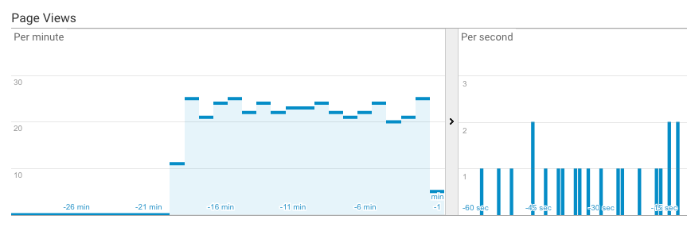

# torfaker



torfaker is a fake traffic bot based on tor and phantomjs.
It uses multiple tor clients working in parallel to provide as much unique endpoints as possible.
Each tor client is used by phantomjs - a headless browser which visits web address provided in config.
torfaker is also a single domain crawler. After visiting the main site, torfaker collects urls and crawl arround your website.

torfaker with default config can generate around **850 000 page views per month**.

torfaker it's not only about fake traffic. It is also great starter for all web scrapping projects. Simply swap main phantomjs file in config and you are ready to go!

## limitations

Currently you can only crawl `.com` and `.html` pages. I should also mention that this bot is not production ready - forever/ supervisord are not included, user activity is not simulated etc. Please keep in mind that there is only 9000 tor endpoints which is not a lot for this amount of traffic.

## dependencies

You have to install tor and phantomjs globally on your machine before running torfaker. On OS X:

```bash
brew install tor
brew install phantomjs
```

## but tor is slow

True! To make torfaker faster all phantomjs instances use shared cache.
To make situation even better phantomjs reject all site resources expect Google analytics scripts.
Pure HTML is lightweight. Thanks to this optimizations it works effortlessly with tor bandwidth.

## how to start

Set your site in `/app/node_modules/config/index.js` on object key phantomjs.domain

```bash
npm run build
npm run start
```

Process output is silent. Everything goes into the logs. To inspect the situation:

```bash
npm run logs
```

Enjoy 📈📈📈
